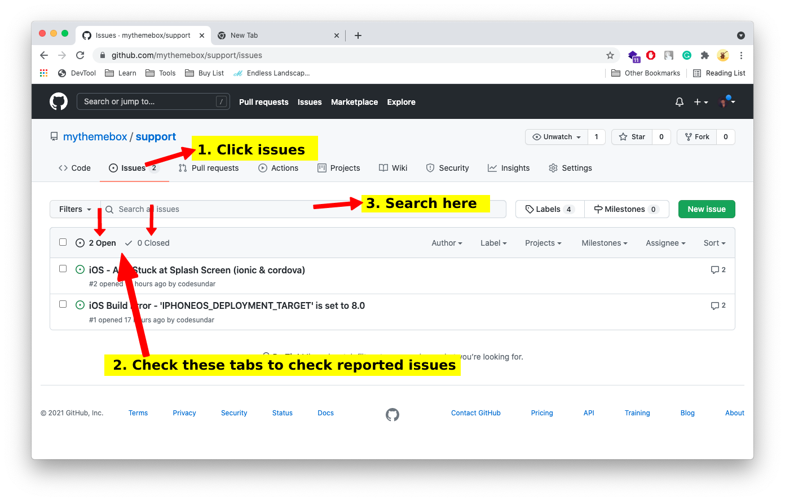
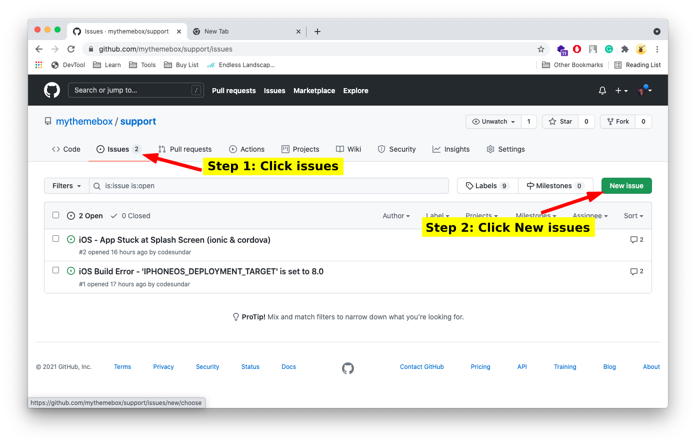
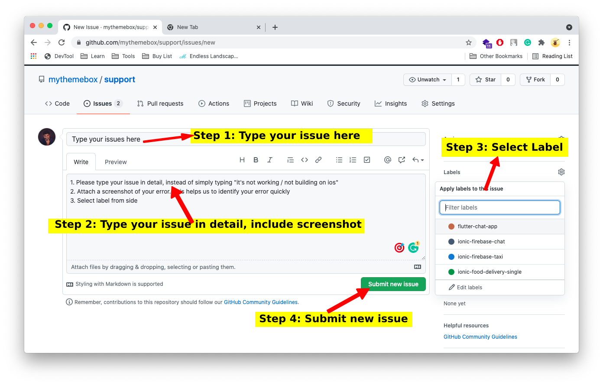

# MyThemeBox Support

Hello,

This is an official support channel for mythemebox.com, where you can request an issues & find solutions.

## How to raise an issue?

I strongly recommend to check the existing issues & solution, before raising a new issues.

**Step 1:** Goto Issues page & Search for an exising issues

If you're not finding any issues, you can raise a new issues

**Step 2:** Select new issue & Describe your issues in details with screenshot.

