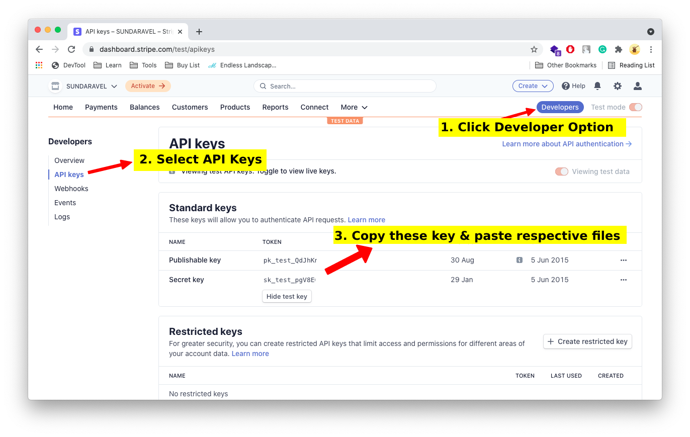

# Ionic Stripe Setup

This article, I'm going to guide you how to setup stripe for ionic..

Note: Payment related code is already written inside product, so you don't need to write new code. This article is only for setup.

You need to update keys inside

- projectname/src/index.html
- fcf/functions/index.js

### Step 1: Goto Stripe Account

As a first step, signup/login with your [stripe](https://stripe.com/) account. Make sure stripe is supported in your country [Check here](https://stripe.com/global) to collect payments

### Step 2: Setup Keys

Replace your key inside these files

1. project/src/index.html
2. fcf/functions/index.js
